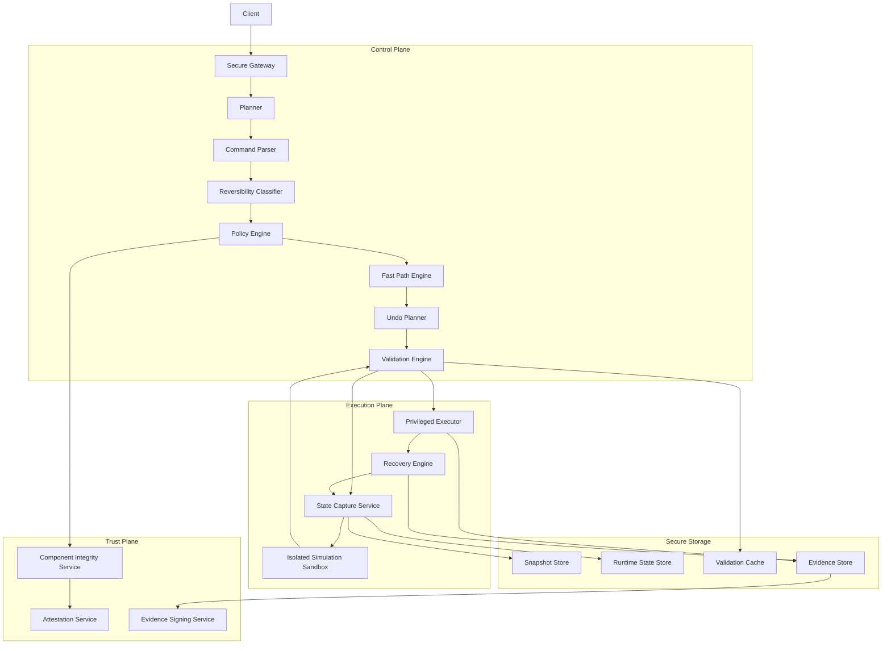
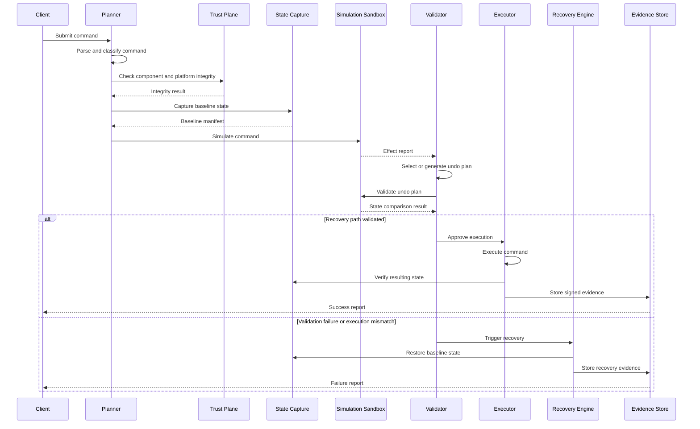

# SafeShell — Trusted Transactional Command Execution Framework

SafeShell is a transactional command execution framework for Linux. It receives a proposed system command, evaluates its safety, captures the relevant system state, simulates the command in an isolated environment, validates a recovery path, executes the command only when recovery is assured, and restores the system if execution deviates from the expected behavior.

SafeShell is designed as a trusted platform component rather than a simple command wrapper. It combines secure design, isolation, measured execution, hardened supply-chain practices, holistic state rollback, and performance-aware processing.

---

## Core Approach

SafeShell follows a safety-first execution model.

- Every command is parsed and classified before execution.
- Dangerous commands are rejected early using deterministic policy rules.
- A recoverable baseline state is captured before simulation or execution.
- Commands are first simulated in an isolated environment.
- The observed effect of the command is used to build and validate recovery behavior.
- AI-generated recovery plans are treated as untrusted hypotheses.
- Recovery is guaranteed through snapshot and runtime state restoration.
- Platform integrity is verified before high-risk operations.
- Every decision produces signed, auditable evidence.
- Common reversible commands use fast paths to avoid unnecessary overhead.

SafeShell does not attempt to make every command reversible. It explicitly classifies commands and refuses to fabricate recovery behavior for operations that cannot be safely undone.

---

## Safety Invariants

SafeShell operates under strict invariants.

| Invariant | Meaning |
|---|---|
| No live execution without recovery | A command is not executed on the real system unless a recoverable baseline exists. |
| AI output is not trusted directly | An AI-generated undo plan is used only after schema validation and simulation-based verification. |
| Irreversibility is explicit | Commands with external or unrecoverable effects are classified honestly and gated accordingly. |
| Simulation is evidence, not certainty | Simulation reduces risk but does not guarantee perfect prediction. |
| Mismatch triggers recovery | If real execution differs from simulated behavior, SafeShell restores the baseline or escalates. |
| High-risk operations require integrity checks | Privileged operations are allowed only when SafeShell and platform integrity checks pass. |
| Every action is auditable | Classification, policy decisions, simulation results, execution results, and recovery actions are recorded. |

---

## System Architecture

SafeShell is separated into control, trust, execution, and storage components. This separation reduces privilege exposure and makes the system easier to audit.



### Component Responsibilities

| Component | Responsibility |
|---|---|
| Client | Submits commands, requests rollback, and receives reports. |
| Secure Gateway | Authenticates requests and enforces access control. |
| Planner | Parses, classifies, and evaluates commands. |
| Command Parser | Converts raw command input into a structured command record. |
| Reversibility Classifier | Determines whether a command is reversible, reversible-with-caveats, or irreversible. |
| Policy Engine | Applies deny rules, scope limits, privilege checks, and integrity requirements. |
| Fast Path Engine | Handles known reversible commands using deterministic recovery templates. |
| Undo Planner | Produces structured recovery plans. |
| Validation Engine | Validates recovery plans using isolated simulation and state comparison. |
| State Capture Service | Captures filesystem and runtime state before execution. |
| Isolated Simulation Sandbox | Executes commands in a confined environment. |
| Privileged Executor | Executes approved commands on the real system. |
| Recovery Engine | Restores filesystem and runtime state when needed. |
| Integrity Service | Verifies SafeShell components and configuration. |
| Attestation Service | Uses platform attestation where available. |
| Evidence Signing Service | Signs execution and recovery evidence. |
| Snapshot Store | Stores filesystem snapshots. |
| Runtime State Store | Stores service, kernel, module, network, and process state manifests. |
| Validation Cache | Stores previously validated command and recovery results. |
| Evidence Store | Stores tamper-evident audit records. |

---

## Command Processing Flow

SafeShell processes commands through a controlled sequence. The flow is deterministic, observable, and recoverable.



### Processing Behavior

When a command is submitted, SafeShell performs the following operations:

1. The command is parsed into a structured representation.
2. The command is classified by reversibility and risk.
3. The policy engine checks whether the command is allowed.
4. Platform and component integrity are verified for privileged operations.
5. Baseline filesystem and runtime state are captured.
6. The command is simulated in an isolated environment.
7. The observed effect is converted into an effect report.
8. A recovery plan is selected or generated.
9. The recovery plan is validated by simulation and state comparison.
10. The command is executed only if a valid recovery path exists.
11. The resulting system state is verified against the expected state.
12. Evidence is recorded and signed.
13. If verification fails, recovery restores the baseline state.

---

## Command Representation

SafeShell does not pass raw shell text to privileged components. Commands are converted into structured records.

A structured command record includes:

- Command binary or operation type.
- Arguments.
- Target paths, services, interfaces, modules, or kernel parameters.
- Required privilege level.
- Expected state domains.
- Reversibility classification.
- Risk level.
- Policy constraints.

This representation allows SafeShell to reason about commands deterministically and prevents unvalidated shell execution.

---

## Reversibility Classification

Every command is classified before expensive validation work begins.

| Classification | Meaning | SafeShell Behavior |
|---|---|---|
| Reversible | The command has a known inverse. | Use deterministic fast path where possible. |
| Reversible-with-caveats | Recovery is possible but may require snapshot restore or service restart. | Validate carefully; allow snapshot-only recovery if needed. |
| Irreversible or unknown | The command has external effects or no reliable inverse. | Reject, require explicit approval, or refuse to fabricate undo behavior. |

### Example Classification Behavior

| Command Type | Example | Classification |
|---|---|---|
| Directory creation | `mkdir /opt/demo` | Reversible |
| File creation | `touch /etc/demo.conf` | Reversible |
| File move | `mv /etc/a.conf /etc/b.conf` | Reversible |
| Service enable | `systemctl enable demo.service` | Reversible |
| Kernel parameter change | `sysctl -w kernel.hostname=demo` | Reversible |
| Module load | `modprobe dummy` | Reversible |
| Network interface change | `ip link set dev eth0 down` | Reversible |
| Package installation | `apt install package` | Reversible-with-caveats |
| Recursive deletion | `rm -rf /var/lib/data` | Reversible-with-caveats through snapshot |
| Remote API mutation | `curl -X POST https://example.com/delete` | Irreversible or unknown |
| Raw block device write | `dd if=image of=/dev/sda` | Rejected |

---

## Policy Engine

The policy engine is deterministic and auditable. It rejects unsafe operations before simulation or execution.

### Policy Inputs

The policy engine evaluates:

- Structured command record.
- Reversibility classification.
- Target scope.
- Privilege requirements.
- Platform integrity result.
- Cached validation result.
- Resource quota status.
- Command history and rate limits.

### Policy Outputs

The policy engine can produce the following decisions:

| Decision | Meaning |
|---|---|
| Approve | Command may proceed to state capture and simulation. |
| Approve with snapshot-only recovery | Command may proceed, but recovery relies on snapshot restoration. |
| Require confirmation | Human approval is required before execution. |
| Require attestation | Command may proceed only after platform integrity verification. |
| Reject | Command is denied and no execution occurs. |

### Rejection Examples

SafeShell rejects operations such as:

- Recursive deletion of critical system paths.
- Raw writes to block devices.
- Broad disabling of firewall rules.
- Attempts to disable auditing or logging.
- Tampering with SafeShell evidence or configuration.
- Commands that attempt to escape simulation confinement.
- Operations that bypass integrity or attestation checks.

---

## Simulation Model

SafeShell uses real execution inside an isolated environment rather than static prediction alone.

The simulation environment provides:

- Filesystem isolation using copy-on-write overlays.
- Namespace isolation for filesystem, process, and network views.
- Syscall restrictions for dangerous operations.
- Resource limits for CPU, memory, disk, and execution time.
- Observation of filesystem and runtime state changes.

### Simulation Output

Simulation produces an effect report containing:

- Files created, modified, renamed, or deleted.
- Permission and ownership changes.
- Service state changes.
- Kernel parameter changes.
- Kernel module changes.
- Network interface, address, route, or firewall changes.
- Process creation or termination.
- Exit code.
- Standard output and standard error.
- Resource usage.
- Unexpected behavior or errors.

The effect report is the evidence used to build and validate recovery behavior.

---

## Undo Planning Model

SafeShell uses two recovery planning paths.

### Deterministic Fast Paths

Known reversible commands use pre-defined recovery templates.

Examples:

| Operation | Recovery Action |
|---|---|
| Create directory | Remove directory if empty |
| Create file | Remove newly created file |
| Move file | Move file back |
| Enable service | Disable service |
| Start service | Stop service |
| Change sysctl | Restore previous value |
| Load module | Unload module |
| Bring interface down | Bring interface up |

Fast paths avoid AI calls and reduce latency.

### AI-Assisted Undo Planning

For complex commands, SafeShell uses an AI planner only after simulation has produced an effect report.

AI output is constrained:

- The AI receives the effect report, not only the raw command.
- The AI must return a structured plan.
- Free-form shell text is rejected.
- Each action must reference an observed effect.
- The plan must be schema-valid.
- The plan must pass simulation-based validation.
- AI confidence scores are advisory only.

### Structured Recovery Plan Model

Recovery plans are expressed as structured actions.

Example:

```json
{
  "plan_version": "1.0",
  "actions": [
    {
      "type": "file.remove",
      "path": "/etc/demo/demo.conf",
      "condition": "created_by_command"
    },
    {
      "type": "service.disable",
      "unit": "demo.service"
    },
    {
      "type": "sysctl.set",
      "key": "kernel.hostname",
      "value": "{{baseline.kernel.hostname}}"
    }
  ]
}
```

This model prevents unvalidated shell execution and makes recovery plans auditable.

---

## Recovery Validation

A recovery plan is accepted only after validation.

Validation performs:

1. Simulation of the original command.
2. Application of the recovery plan.
3. Comparison of the resulting state against the baseline state.
4. Classification of remaining differences.

### Allowed Differences

Some differences may be acceptable, such as:

- Log entries.
- Timestamps.
- Temporary files.
- Package cache changes.
- Random identifiers.
- Metrics or telemetry artifacts.

### Disallowed Differences

Validation fails if recovery leaves unexpected changes, such as:

- Missing user data.
- Changed configuration files.
- Unexpected enabled services.
- Unexpected kernel parameter values.
- Unexpected loaded modules.
- Unexpected network changes.
- Unexpected privileged processes.

If validation fails, SafeShell retries within bounded limits, selects snapshot-only recovery where appropriate, or rejects the command.

---

## System State Model

SafeShell does not rely only on filesystem snapshots. It captures relevant runtime state for each command class.

| State Domain | Examples | Capture Method | Recovery Method |
|---|---|---|---|
| Filesystem | Files, directories, permissions, ownership | Snapshot and file hash manifest | Snapshot restore or reverse file operations |
| Services | Unit files, enabled state, active state | Service manager introspection | Enable/disable, start/stop, restart |
| Kernel parameters | sysctl values | Kernel parameter interface | Restore previous values |
| Kernel modules | Loaded modules, module configuration | Module list and configuration files | Load/unload modules |
| Network interfaces | Interface state | Netlink or equivalent | Restore interface state |
| Addresses and routes | IP addresses, routing entries | Network state introspection | Restore addresses and routes |
| Firewall rules | iptables or nftables rules | Ruleset export | Restore saved ruleset |
| Processes | Spawned processes | Process tracking | Terminate spawned processes where safe |
| Packages | Installed or removed packages | Package database state | Package operations or snapshot restore |

This state model allows SafeShell to recover more than files. It recognizes that a Linux system includes volatile runtime state that may not be restored by filesystem rollback alone.

---

## Recovery Model

SafeShell provides layered recovery.

### Recovery Paths

| Path | Purpose |
|---|---|
| Validated undo plan | Fast recovery using structured reverse operations. |
| Runtime state restoration | Restores services, kernel parameters, modules, and network state. |
| Snapshot restoration | Restores filesystem state when command-level undo is unavailable or fails. |
| Escalation | Used when recovery cannot be safely completed. |

### Recovery Triggers

Recovery is triggered when:

- Validation fails after bounded retries.
- Real execution does not match simulated behavior.
- Post-execution verification detects unexpected state.
- A user or operator requests rollback.
- A policy violation is detected after execution begins.
- A resource or timeout boundary is exceeded.

### Recovery Guarantees

SafeShell guarantees that:

- A baseline state manifest exists before execution.
- Snapshot integrity is hashed and recorded.
- Recovery actions are logged.
- Recovery results are verified where possible.
- Recovery evidence is stored.

SafeShell does not guarantee that external side effects can be undone. Operations that affect remote systems are classified as irreversible or unknown unless an explicit, verifiable compensation action exists.

---

## Trust and Platform Integrity

SafeShell is designed to operate within a trusted computing environment. It does not assume that the operating system or its own binaries are safe by default.

### Component Integrity

SafeShell verifies its own critical components before privileged operations.

Verified components include:

- Command planner.
- Policy engine.
- State capture service.
- Simulation sandbox.
- Privileged executor.
- Recovery engine.
- Evidence signing service.
- Configuration files.

Integrity verification is based on cryptographic hashes and signed manifests.

### Measured Execution

Where TPM support is available, SafeShell components can be measured into Platform Configuration Registers.

This enables:

- Verification that SafeShell binaries have not been modified.
- Detection of unauthorized boot state changes.
- Binding high-risk operations to trusted platform state.
- Attestation of the execution environment.

### Attestation

For high-risk commands, SafeShell can require attestation evidence before execution.

Attestation may include:

- PCR state.
- Component hashes.
- Secure Boot status.
- Signed SafeShell manifest.
- Platform quote where supported.

If attestation fails, high-risk operations are denied.

### Sealed Secrets

Cryptographic keys used for evidence signing or external service authentication can be sealed to platform state.

This means keys are unavailable if the platform enters an untrusted state. Sealing protects evidence integrity and prevents offline tampering.

### Attested Rollback

Snapshot restoration can be bound to platform integrity checks.

Before rollback, SafeShell verifies that:

- The snapshot is intact.
- The snapshot hash matches the recorded manifest.
- The platform state is trusted.
- The recovery request is authorized.

This prevents an attacker from forcing rollback to a compromised or malicious state.

---

## Toolchain and Supply Chain Security

SafeShell’s security depends on the integrity of its build and release process. The plan therefore includes supply-chain controls independent of runtime behavior.

### Source Integrity

Source control protections include:

- Signed commits where possible.
- Branch protection rules.
- Mandatory review for security-sensitive changes.
- Dependency pinning.
- Lockfile verification.
- Vulnerability scanning.

### Hardened Build Process

The build process should enforce:

- Isolated build environments.
- Reproducible build inputs.
- Compiler hardening features.
- Static analysis.
- Security linting.
- Vulnerability checks.
- Test execution before release.

Recommended compiler-level protections include:

- Position-independent executables.
- Stack protection.
- Read-only relocations.
- Immediate symbol binding.
- Control-flow integrity where supported.
- Memory-safe runtime behavior where the implementation language provides it.

### Artifact Transparency

Every release artifact should be accompanied by:

- Software Bill of Materials.
- Build provenance metadata.
- Cryptographic signatures.
- Verification instructions.
- Release hash manifest.

### Provenance Model

SafeShell artifacts should be traceable from source to deployment.

Provenance includes:

- Source revision.
- Build environment identity.
- Dependency list.
- Build command or pipeline identity.
- Output artifact hashes.
- Signature metadata.

This allows verifiers to confirm that a SafeShell binary was produced from the expected source and build process.

---

## Isolation and Runtime Hardening

SafeShell itself is a privileged component. It must be hardened against compromise.

### Privilege Separation

SafeShell separates responsibilities:

| Component | Privilege Model |
|---|---|
| Planner | Minimal privilege; handles parsing, classification, and policy evaluation. |
| Validator | Limited privilege; coordinates simulation and state comparison. |
| Executor | Controlled privilege; performs real execution and recovery. |
| Trust Service | Restricted access to keys, attestation, and signing operations. |
| Evidence Store | Write-once or append-only where possible. |

This separation limits the impact of a compromised component.

### Simulation Sandbox

The simulation sandbox uses multiple isolation mechanisms.

| Mechanism | Purpose |
|---|---|
| Namespaces | Isolate filesystem, process, and network views. |
| Copy-on-write filesystem | Capture writes without modifying the real system. |
| Syscall filtering | Block dangerous kernel operations. |
| Filesystem confinement | Restrict access to the sandbox workspace. |
| Resource limits | Prevent CPU, memory, disk, and time exhaustion. |
| Process limits | Prevent process fork bombs and runaway processes. |

### Runtime Confinement

SafeShell components are confined using layered controls.

| Layer | Purpose |
|---|---|
| Least privilege | Grant only required capabilities. |
| Filesystem restrictions | Limit access to configuration, state, and evidence paths. |
| Syscall restrictions | Reduce kernel attack surface. |
| Mandatory access control | Enforce system-wide policy on SafeShell processes. |
| Network restrictions | Limit external communication to required endpoints. |
| Audit logging | Record security-relevant events. |

### Dangerous Operation Handling

SafeShell does not allow simulated commands to perform operations that could escape confinement.

Restricted operations include:

- Raw block device access.
- Kernel module loading outside allowed command classes.
- System reboot or shutdown.
- Mounting privileged filesystems.
- Changing global security policy.
- Disabling audit or logging mechanisms.
- Direct access to TPM secrets outside the trust service.

---

## Performance Strategy

SafeShell must be safe without being impractically slow. Performance is treated as a design requirement.

### Fast Paths

Known reversible commands bypass AI-based planning.

Benefits:

- Lower latency.
- Reduced cost.
- Deterministic behavior.
- Easier auditability.

Fast paths are used when:

- The command class is known.
- The inverse operation is deterministic.
- The target scope is bounded.
- The state model can verify recovery.

### Validation Cache

SafeShell caches validated results.

Cache keys include:

- Command fingerprint.
- Argument fingerprint.
- Environment fingerprint.
- Policy version.
- State collector version.
- Sandbox policy version.

Cached results may include:

- Classification result.
- Simulation effect report.
- Validated recovery plan.
- Resource usage metrics.

Cache entries are invalidated when policy, system state collectors, sandbox behavior, or SafeShell components change.

### Copy-on-Write Snapshots

SafeShell uses copy-on-write snapshot mechanisms where available.

This provides:

- Fast snapshot creation.
- Efficient storage usage.
- Point-in-time recovery.
- Lower overhead compared with full disk copies.

### Resource Quotas

SafeShell enforces limits on:

- Snapshot count.
- Snapshot disk usage.
- Simulation execution time.
- Recovery attempts.
- AI generation attempts.
- Cache size.
- Evidence retention.

These quotas prevent resource exhaustion and keep SafeShell predictable.

### Performance Metrics

SafeShell records:

- Command intake-to-decision time.
- Simulation time.
- Recovery validation time.
- Execution time.
- Recovery time.
- Cache hit rate.
- Fast path hit rate.
- Snapshot creation time.
- Overhead compared with direct execution.

---

## Evidence and Audit Model

SafeShell generates an evidence package for every operation.

### Evidence Package Contents

Each evidence package includes:

- Original command.
- Structured command record.
- Command fingerprint.
- Reversibility classification.
- Policy decision.
- Integrity check result.
- Attestation result, if used.
- Baseline state manifest.
- Snapshot hash.
- Simulation effect report.
- Recovery plan.
- Validation result.
- Execution result.
- Post-execution verification result.
- Recovery outcome, if triggered.
- Timestamps.
- Resource usage metrics.

### Evidence Properties

Evidence is:

- Hashed.
- Signed.
- Time-stamped.
- Stored in append-only form where possible.
- Bound to platform attestation where supported.
- Exportable for external audit.

### Audit Events

SafeShell records:

- Command submission.
- Policy rejection.
- Integrity failure.
- Simulation failure.
- Validation failure.
- Execution mismatch.
- Recovery trigger.
- Snapshot restore.
- Evidence signing.
- Authorization requests.

---

## Threat Model

| Threat | Description | SafeShell Response |
|---|---|---|
| Malicious command execution | A command attempts destructive action. | Policy rejection, classification, simulation, and recovery controls. |
| Command injection | Unvalidated shell input is used for privileged execution. | Structured command representation and schema-validated recovery actions. |
| AI-generated incorrect plan | The AI produces a wrong or malicious undo plan. | Schema validation, simulation-based verification, and bounded retries. |
| Simulation escape | A simulated command affects the real system. | Namespaces, copy-on-write isolation, syscall filtering, and filesystem confinement. |
| SafeShell tampering | SafeShell binaries or configuration are modified. | Component integrity checks, signed manifests, and measured execution. |
| Rollback abuse | An attacker forces rollback to a compromised state. | Snapshot integrity hashes, attested rollback, and signed evidence. |
| Supply-chain compromise | Malicious dependencies or build artifacts are introduced. | Pinned dependencies, signed artifacts, SBOMs, and provenance verification. |
| Privilege escalation | A SafeShell component is exploited to gain privilege. | Privilege separation, least privilege, confinement, and mandatory access control. |
| Resource exhaustion | Simulation or snapshots consume excessive resources. | Quotas, timeouts, and cache limits. |
| Audit tampering | Logs or evidence are altered. | Hashed evidence, signed records, and append-only storage where possible. |

---

## Supported Command Scope

SafeShell initially targets command classes where recovery can be modeled reliably.

### Supported Classes

| Class | Examples | Recovery Approach |
|---|---|---|
| Filesystem | `mkdir`, `touch`, `cp`, `mv`, limited `rm` | Reverse operations and snapshots |
| Package management | Install, remove, upgrade | Package state capture and snapshot fallback |
| Service management | Enable, disable, start, stop | Service manager state reversal |
| Kernel parameters | sysctl changes | Previous value restoration |
| Kernel modules | Load, unload | Module state reversal |
| Basic networking | Interface, address, route, firewall changes | Network state restoration |

### Explicitly Excluded Classes

| Class | Reason |
|---|---|
| Arbitrary shell pipelines | No general inverse exists. |
| Remote side effects | Cannot be undone locally. |
| Hardware state changes | May require firmware or device-specific handling. |
| Raw disk writes | High risk and generally irreversible. |
| Security policy destruction | Undermines SafeShell guarantees. |

---

## Validation Strategy

SafeShell correctness is validated through multiple test categories.

### Functional Validation

- Reversible commands are correctly classified.
- Fast paths generate correct recovery actions.
- Simulation captures expected effects.
- Recovery plans restore baseline state.
- Snapshot restoration works when undo plans fail.

### Security Validation

- Dangerous commands are rejected.
- Simulation escape attempts are blocked.
- Tampered SafeShell components are detected.
- Invalid signatures are rejected.
- Attestation failure blocks high-risk operations.
- Evidence tampering is detected.

### State Validation

- Filesystem state is restored.
- Service state is restored.
- Kernel parameter values are restored.
- Module state is restored.
- Network configuration is restored.
- Unexpected processes are terminated where safe.

### Performance Validation

- Fast path latency is measured.
- Cache hit behavior is verified.
- Snapshot overhead is measured.
- Retry behavior remains bounded.
- Resource quotas prevent exhaustion.

---

## Operational Behavior

SafeShell behavior is deterministic and observable.

### Successful Operation

A successful operation results in:

- Approved command execution.
- Verified post-execution state.
- Signed evidence package.
- Available rollback path.
- Audit record.

### Failed Operation

A failed operation results in:

- No live execution, or immediate recovery if execution began.
- Baseline state restoration where possible.
- Recovery evidence package.
- Clear failure reason.
- Audit record.

### Rejected Operation

A rejected operation results in:

- No simulation.
- No execution.
- No recovery path.
- A policy rejection report.
- An audit record.

---

## Configuration Model

SafeShell behavior is controlled through declarative configuration.

Configuration includes:

- Enabled command classes.
- Policy rules.
- Risk thresholds.
- Attestation requirements.
- Snapshot retention limits.
- Cache behavior.
- Resource quotas.
- Logging level.
- Evidence retention.
- AI planner availability.
- Trust policy.

Configuration changes are themselves subject to integrity verification.

---

## Observability Model

SafeShell produces structured operational data.

Observability includes:

- Command classification decisions.
- Policy decisions.
- Integrity check results.
- Simulation results.
- Validation results.
- Execution results.
- Recovery events.
- Cache behavior.
- Resource usage.
- Evidence signing events.

Logs are structured, machine-readable, and suitable for audit analysis.

---

## Deliverables

The SafeShell project includes:

- Command intake and parsing system.
- Reversibility classifier.
- Deterministic policy engine.
- Fast path engine for known reversible commands.
- AI-assisted undo planner with structured output.
- Simulation sandbox.
- State capture system for filesystem and runtime state.
- Validation engine for recovery plans.
- Privileged executor with controlled execution.
- Recovery engine with snapshot and runtime state restoration.
- Evidence store with signed audit packages.
- Integrity and attestation service.
- Supply-chain and build hardening process.
- Benchmark suite.
- Documentation and architecture diagrams.

---

## Explicit Limitations

SafeShell does not claim:

- Universal command reversal.
- Perfect simulation of all system behavior.
- Recovery from external side effects.
- Complete elimination of privilege escalation risk.
- Unlimited rollback history.
- Guaranteed correctness for arbitrary shell pipelines.
- Full firmware-level Secure Boot integration unless deployed on supporting hardware.

SafeShell provides bounded, verifiable safety for defined command classes. It favors honest limitations over fabricated guarantees.

---

## Summary

SafeShell is a trusted transactional command execution framework. It combines deterministic policy control, isolated simulation, structured recovery planning, holistic state capture, platform integrity verification, hardened supply-chain practices, layered runtime confinement, and performance-aware execution.

The design is grounded in a simple principle: system commands should not be executed on live systems unless their effects can be understood, validated, and recovered.
