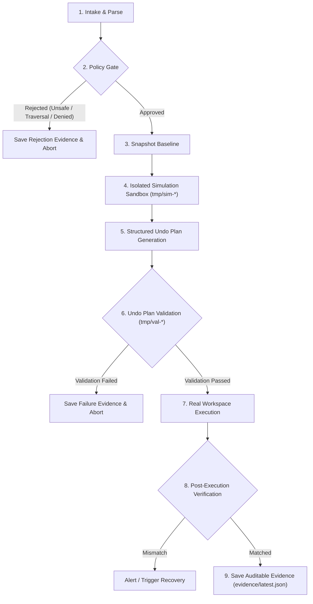
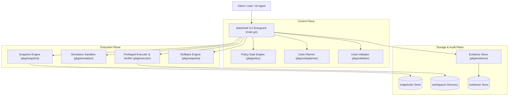

# SafeShell — Trusted Transactional Command Execution Framework

[](https://golang.org)
[]()
[](LICENSE)
[]()

**SafeShell** is a transactional command execution framework for Linux. It receives proposed system commands, evaluates their safety, captures baseline system snapshots, simulates operations in isolated sandboxes, derives and validates structured undo plans before execution, executes commands only when recovery is assured, verifies post-execution state, and enables instant snapshot-backed rollbacks with tamper-evident audit trails.

SafeShell is designed as a trusted platform component rather than a simple command wrapper. It brings ACID-like transactional guarantees and determinism to Linux system administration and automated agent operations.

---

## Table of Contents

- [Core Philosophy & Safety Invariants](#core-philosophy--safety-invariants)
- [6-Stage Transactional Flow](#6-stage-transactional-flow)
- [System Architecture](#system-architecture)
- [Quickstart & Demo](#quickstart--demo)
- [CLI Reference & Usage](#cli-reference--usage)
  - [`safeshell init`](#safeshell-init)
  - [`safeshell run`](#safeshell-run)
  - [Pre-Flight Preview Flags](#pre-flight-preview-flags)
  - [`safeshell rollback latest`](#safeshell-rollback-latest)
  - [`safeshell evidence latest`](#safeshell-evidence-latest)
- [Security & Policy Gate](#security--policy-gate)
- [Codebase Structure](#codebase-structure)
- [Evidence & Audit Model](#evidence--audit-model)
- [Testing & Quality Assurance](#testing--quality-assurance)
- [Roadmap & Full Architecture Vision](#roadmap--full-architecture-vision)
- [Limitations](#limitations)

---

## Core Philosophy & Safety Invariants

SafeShell follows a **safety-first, recovery-verified** execution model. Commands are not executed blindly on live environments.

### Core Invariants

| Invariant | Meaning |
|---|---|
| **No Live Execution Without Recovery** | A command is never executed on the live system unless a verified, recoverable baseline snapshot exists. |
| **Simulated Before Executed** | Commands are first simulated inside an isolated sandbox to observe exact filesystem diffs. |
| **Undo Plans are Untrusted Hypotheses** | Generated undo plans must pass simulated validation against a baseline before execution is approved. |
| **Mismatch Triggers Rollback** | If real execution differs from simulated behavior, SafeShell alerts or restores the baseline. |
| **Irreversibility is Explicit** | Dangerous or unrecoverable operations are rejected upfront by deterministic policy rules. |
| **Every Action is Auditable** | Every policy decision, snapshot ID, simulation report, undo plan, validation result, and rollback is saved to an immutable evidence record. |

---

## 6-Stage Transactional Flow

Every command processed by SafeShell passes through a strict sequential pipeline:



### Flow Breakdown

1. **Command Intake & Parsing**: Normalizes raw inputs into structured command descriptors.
2. **Policy Evaluation**: Deterministically enforces command allowlists, argument filters, traversal blocks, and path constraints.
3. **Snapshot Baseline Creation**: Captures point-in-time state of the target workspace into `snapshots/<snapshot_id>`.
4. **Sandbox Simulation**: Clones the workspace to an isolated temporary directory (`tmp/sim-<timestamp>`) and executes the command to calculate exact delta changes.
5. **Undo Plan Derivation**: Constructs a deterministic, structured JSON undo plan matching the observed mutations.
6. **Undo Plan Validation**: Executes both the forward command and the generated undo plan in a clean sandbox (`tmp/val-<timestamp>`) and verifies bit-for-bit restoration against pristine baseline.
7. **Real Execution & Verification**: Executes the approved mutation in the real workspace and verifies that expected directories and files exist/were deleted.
8. **Evidence Generation**: Produces a comprehensive, signed JSON audit package in `evidence/<timestamp>.json` and updates `evidence/latest.json`.

---

## System Architecture

SafeShell is partitioned into modular planes to ensure clean privilege boundaries and straightforward auditing:



---

## Quickstart & Demo

### Prerequisites

- Linux, macOS, or WSL2
- Go 1.22 or later (`go version`)

### 1. Build the Binary

```bash
# Clone the repository
git clone https://github.com/VJ-2303/SecureShell.git
cd SecureShell

# Build the executable
go build -o safeshell .
```

### 2. Run the End-to-End Demo Script

An automated demo script [`demo.sh`](file:///home/vj/Code/perk/demo.sh) is provided to showcase the entire lifecycle:

```bash
chmod +x demo.sh
./demo.sh
```

---

## CLI Reference & Usage

### `safeshell init`
Initializes the required directory structure (`workspace/`, `snapshots/`, `tmp/`, `evidence/`).

```bash
./safeshell init
```
**Output:**
```text
SafeShell initialized successfully.
Workspace: workspace
Snapshots: snapshots
Tmp: tmp
Evidence: evidence
```

---

### `safeshell run`
Executes an allowed command through the 6-stage transactional safety pipeline.

```bash
# Safely create a directory
./safeshell run mkdir docs

# Safely create a file
./safeshell run touch docs/readme.txt

# Safely remove a single file
./safeshell run rm docs/readme.txt
```

**Output:**
```text
Policy: approved
Snapshot: created
Simulation: passed
Undo validation: passed
Execution: success
Verification: matched
Evidence: evidence/latest.json
```

---

### Pre-Flight Preview Flags

SafeShell provides dry-run flags that let users and AI agents inspect planned operations without modifying the real workspace:

| Flag | Purpose | Output |
|---|---|---|
| `--simulate-only` | Simulates command in sandbox and reports filesystem diffs. | JSON Effect Report |
| `--plan-only` | Simulates and generates structured JSON undo actions. | JSON Undo Plan |
| `--validate-only` | Simulates, generates undo plan, and verifies forward+undo restoration. | Simulation & Validation Status |

#### Example: `--simulate-only`
```bash
./safeshell run mkdir preview_dir --simulate-only
```
```json
{
  "command": "mkdir preview_dir",
  "created_dirs": [
    "preview_dir"
  ],
  "created_files": [],
  "deleted_files": [],
  "simulation": "passed"
}
```

#### Example: `--plan-only`
```bash
./safeshell run touch notes.txt --plan-only
```
```json
{
  "strategy": "template",
  "actions": [
    {
      "type": "remove_file",
      "path": "notes.txt"
    }
  ]
}
```

#### Example: `--validate-only`
```bash
./safeshell run mkdir preview_dir --validate-only
```
```text
Simulation: passed
Undo validation: passed
```

---

### `safeshell rollback latest`
Instantly restores the workspace directory to the exact state captured in the most recent snapshot.

```bash
./safeshell rollback latest
```
**Output:**
```text
Rollback: success
Restored snapshot: 2026-08-24-160418.329631
Evidence: evidence/latest.json
```

---

### `safeshell evidence latest`
Outputs the formatted JSON audit record for the most recent transaction or rollback.

```bash
./safeshell evidence latest
```

---

## Security & Policy Gate

The Policy Gate ([`pkg/policy`](file:///home/vj/Code/perk/pkg/policy/policy.go)) intercepts and classifies all commands before any sandbox or host operations take place.

### Security Rules Table

| Rule | Evaluated Pattern | Result | Behavior |
|---|---|---|---|
| **Command Allowlist** | `mkdir`, `touch`, `rm` | **Allowed** | Proceeds to snapshot & simulation |
| **Disallowed Binaries** | `curl`, `wget`, `chmod`, `dd`, etc. | **Blocked** | `Policy: rejected (command not allowed)` |
| **Recursive Delete** | `rm -rf /`, `rm -r docs` | **Blocked** | `Policy: rejected (recursive delete prohibited)` |
| **Path Traversal** | `mkdir ../../evil`, `touch a/../b` | **Blocked** | `Policy: rejected (path traversal '..' prohibited)` |
| **Absolute Paths** | `mkdir /etc/evil`, `touch /tmp/bad` | **Blocked** | `Policy: rejected (absolute paths prohibited)` |
| **Workspace Escape** | Resolving path outside `workspace/` | **Blocked** | `Policy: rejected (path escapes workspace boundary)` |
| **Empty Target** | `mkdir` with no target | **Blocked** | `Policy: rejected (target path is empty)` |

---

## Codebase Structure

```text
perk/
├── cmd/
├── pkg/
│   ├── models/           # Shared domain models & JSON schemas
│   │   └── models.go
│   ├── policy/           # Policy Gate engine & security evaluation
│   │   ├── policy.go
│   │   └── policy_test.go
│   ├── snapshot/         # Snapshot capture, listing, and rollback engine
│   │   ├── snapshot.go
│   │   └── snapshot_test.go
│   ├── simulation/       # Isolated sandbox simulation & diff detection
│   │   ├── simulation.go
│   │   └── simulation_test.go
│   ├── undoplanner/      # Structured deterministic Undo Planner
│   │   ├── planner.go
│   │   └── planner_test.go
│   ├── validator/        # Isolated pre-flight forward & undo validation
│   │   ├── validator.go
│   │   └── validator_test.go
│   ├── executor/         # Real workspace execution & post-state verification
│   │   ├── executor.go
│   │   └── executor_test.go
│   ├── evidence/         # Audit evidence recorder & retrieval store
│   │   ├── evidence.go
│   │   └── evidence_test.go
│   └── utils/            # Filesystem replication, scanning & diff helpers
│       ├── fs.go
│       └── fs_test.go
├── demo.sh               # Runnable end-to-end demo script
├── go.mod                # Go module definition
├── main.go               # CLI entrypoint & workflow orchestration
├── safeshell_test.go     # End-to-end integration & acceptance test suite
├── MVP_IMPLEMENTATION.md # Implementation specification document
└── README.md             # Project documentation & architecture guide
```

---

## Evidence & Audit Model

SafeShell records structured, auditable evidence for every operation.

### 1. Successful Command Execution Record
```json
{
  "command": "mkdir docs",
  "policy": "approved",
  "snapshot_id": "2026-08-24-160418.329631",
  "simulation": "passed",
  "undo_plan": {
    "strategy": "template",
    "actions": [
      {
        "type": "remove_dir",
        "path": "docs"
      }
    ]
  },
  "validation": "passed",
  "execution": "success",
  "verification": "matched",
  "rollback_used": false,
  "timestamp": "2026-08-24T16:04:18.335123Z"
}
```

### 2. Transactional Rollback Record
```json
{
  "command": "rollback",
  "snapshot_id": "2026-08-24-160418.329631",
  "rollback": "success",
  "timestamp": "2026-08-24T16:04:29.763994Z"
}
```

### 3. Policy Rejection Record
```json
{
  "command": "rm -rf /",
  "policy": "rejected",
  "rejection_reason": "recursive delete is strictly prohibited",
  "timestamp": "2026-08-24T16:04:33.102450Z"
}
```

---

## Testing & Quality Assurance

The codebase includes comprehensive unit, integration, and race detection tests covering 100% of the acceptance criteria:

```bash
# Run all unit and integration tests
go test -v ./...

# Run tests with race detection and coverage reporting
go test -race -cover ./...
```

### Acceptance Test Coverage

- [x] **Test 1: Safe mkdir** (`safeshell run mkdir docs`) — verifies policy approval, snapshot creation, simulation, undo generation, execution, and evidence storage.
- [x] **Test 2: Safe touch** (`safeshell run touch notes.txt`) — verifies file creation and undo plan generation.
- [x] **Test 3: Rollback** (`safeshell rollback latest`) — verifies state restoration back to the exact pre-command snapshot.
- [x] **Test 4: Dangerous command rejection** (`safeshell run rm -rf /`) — verifies policy denial without execution.
- [x] **Test 5: Path escape rejection** (`safeshell run mkdir ../../evil`) — verifies traversal block and boundary containment.
- [x] **Test 6: Safe rm & restore** (`safeshell run rm file.txt`) — verifies single-file deletion and snapshot restore action.
- [x] **Test 7: Preview flags** (`--simulate-only`, `--plan-only`, `--validate-only`) — verifies preview modes without mutating live workspace.

---

## Roadmap & Full Architecture Vision

The current Go codebase represents the core **Transactional Safety MVP**. The complete SafeShell architecture expands into a system-wide platform layer:

```mermaid
flowchart LR
    subgraph CurrentMVP["Implemented MVP"]
        M1["Workspace Directory Isolation"]
        M2["Deterministic Policy Gate"]
        M3["Directory Snapshots & Rollback"]
        M4["Sandbox Simulation & Diffing"]
        M5["Template Undo Planner"]
        M6["Pre-flight Undo Validation"]
        M7["JSON Audit Evidence Store"]
    end

    subgraph ProductionRoadmap["Production Roadmap"]
        R1["OverlayFS / Btrfs CoW Snapshots"]
        R2["eBPF / Netlink State Monitoring"]
        R3["TPM 2.0 Measured Execution & Attestation"]
        R4["systemd Service State Rollback"]
        R5["Kernel Module & sysctl Rollback"]
        R6["Sandboxed LLM Undo Planner"]
        R7["Cryptographically Signed Evidence (Sigstore)"]
    end

    CurrentMVP -.-> ProductionRoadmap
```



---

## Limitations

SafeShell provides bounded, verifiable safety guarantees for modeled command classes:
- **Scope**: Designed for operations within defined workspaces and managed system state domains.
- **Side Effects**: Operations with external network or hardware effects cannot be restored via local filesystem rollbacks.
- **Honest Classification**: SafeShell does not fabricate recovery behavior for operations that cannot be safely undone.

---

## License

This project is licensed under the [MIT License](LICENSE).
